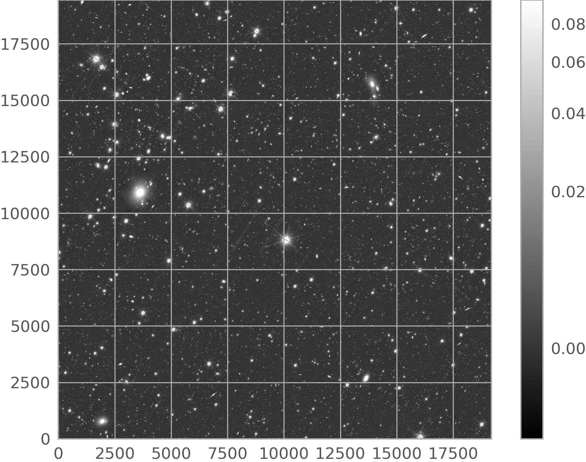
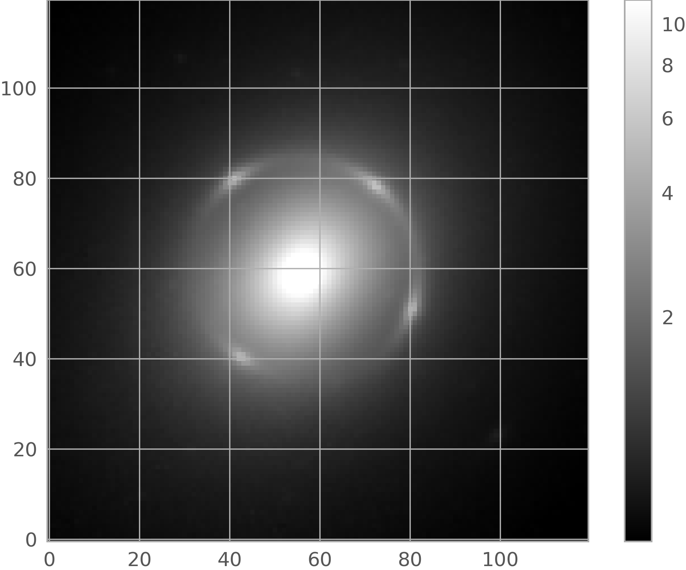

.. _astroquery.esa.euclid:

********************************************
ESA EUCLID Archive (`astroquery.esa.euclid`)
********************************************

**The Euclid mission**

`Euclid <https://www.cosmos.esa.int/web/euclid>`_ is a Medium class ESA mission to map the geometry of the dark Universe.
The mission investigates the distance-redshift relationship and the evolution of cosmic structures. The space telescope is
creating a detailed map of the large-scale structure of the Universe across space and time by observing billions of galaxies
out to 10 billion light-years, across more than a third of the sky. It achieves this by measuring shapes and redshifts of
galaxies and clusters of galaxies out to redshifts ~2, or equivalently to a look-back time of 10 billion years. It therefore
explores how the Universe has expanded and how structure has formed over cosmic history, revealing more about the role of
gravity and the nature of dark energy and dark matter.

Please take note of our `guide <https://www.cosmos.esa.int/web/euclid/data-credits-acknowledgements>`_ on how
to acknowledge and cite Euclid data if you use public Euclid data in your paper.

**hcanovas: remove this paragraph. WHY: it provides too much detail about the mission (compared to other Astroquery pages).
Proposal: add it to the Euclid Archive Help pages (location to be decided):**
The `Euclid Survey <https://www.euclid-ec.org/public/data/surveys/>`_ is done in a 'step-and-stare' mode, where the telescope
points to a position on the sky and then imaging and spectroscopic measurements are performed on an area of ~0.48 deg\ :sup:`2`
around this position. The telescope consists of two cameras, the visible instrument (VIS) and the Near Infrared Spectrometer
and Photometer (NISP) instrument that observe simultaneously using a light splitting dichroic.
For the survey standard operating mode, the telescope undertakes a 4-point dither pattern. At each position VIS and NISP
each take a 560s exposure, consisting of a direct visible image and a red grism exposure. This is followed by further
NISP exposures in the Y, J, and H band filters (87 seconds each). The telescope is then dithered, and the sequence is
repeated starting with a different grism position angle. There are actually two operational grisms oriented 180 degrees
from each other. Each grism will be used twice in this sequence, but with slight angular offsets (+/- 4 degrees),
effectively creating the four different grism angles
(`Scaramella et al. 2022, A&A 662, A112 <https://ui.adsabs.harvard.edu/abs/2022A%26A...662A.112E/abstract>`_).
This standard four-dithers operating mode sequence is called a single observation and all the individual exposures
associated with each observation are organized by Observation ID in the archive. The
`Science Ground Segment <https://www.euclid-ec.org/public/data/ground-segment/>`_ also processes all of its
imaging into merged mosaics, which can contain multiple different observations. All products associated with these
mosaics are organized by Tile ID in the archive.

**hcanovas: remove the following four paragraphs (and example). WHY: it is not intended for public users. None of the astroquery pages provides info like this.
Proposal: Add it to the EC Help content & EC datalabs:** The Euclid Science Archive has several environments
serving different purposes for the `Euclid Consortium <https://www.euclid-ec.org/>`_ members.

1. The OTF ("on-the-fly") environment of the Euclid science archive, first started at the start of science operation exposed data as processed by
the SGS (Science Ground Segment) soon after acquisition to provide an access as soon as possible. In this environment
the data will not be reprocessed and the processing is therefore heterogeneous.

2. The REG (for non-regression testing) environment of the Euclid science archive, where a large area in the sky is processed with the same version for
all data products. The first campaign was run in September 2024, for area of about 500 square degrees (~1000
observations), the next campaign shall be run in March-April 2025.

3. The IDR (Internal Data Release) environment of the Euclid science archive holds the data that will then become public. The first release Q1
opened on the 6th of November 2024, with a first pass on the three Euclid deep fields (EDFN, EDFS and EDFF) as well as
observations on the Lynds Dark Nebula LDN1641.

4. The PDR (Public Data Release) environment of the Euclid science archive holds the public data. Euclid Q1_ data was publicly released on March 19,
2025. The main component of the Q1_ data contains Level 2 data of a single visit (at the depth of the Euclid Wide
Survey) over the Euclid Deep Fields (EDFs): 20 deg\ :sup:`2` of the EDF North, 10 deg\ :sup:`2` of EDF Fornax, and
23 deg\ :sup:`2` of the EDF South. The deep fields will be visited multiple times during the mission.

By default, the object *Euclid*

  >>> from astroquery.esa.euclid import Euclid

makes use of the *PDR* environment. In order to make use of a different one, it is necessary to instantiate the class EuclidClass

  >>> from astroquery.esa.euclid import EuclidClass
  >>> euclid = EuclidClass(environment='IDR')

The parameter *environment* is limited to *IDR*, *OTF*, *PDR* or *REG*.

**Astroquery.esa.euclid**

This Python module provides an Astroquery API to access to the metadata and datasets provided by the 
`European Space Agency Euclid Archive <https://eas.esac.esa.int/sas/>`_ using a `TAP+ <https://astroquery.readthedocs.io/en/latest/utils/tap.html>`_ REST service.
`TAP+ <https://astroquery.readthedocs.io/en/latest/utils/tap.html>`_ is an extension of Table Access Protocol (TAP_)
specified by the International Virtual Observatory Alliance (IVOA_) that incorporates dedicated user space capabilities (see Sect. 2 below). 
The TAP_ query language is Astronomical Data Query Language (ADQL_). TAP_ provides two operation modes: 

* Synchronous: the server response is generated as soon as the request is received.

* Asynchronous: the server starts a job that will execute the request. The first response to the request is a link with information about the job status.

On top of that, this package provides two access modes: 

* Public (default): The results generated by the anonymous ADQL_ queries are public, and deleted from the Archive 72 hours.

* Authenticated: The ADQL_ queries and their outcomes remain in the user space until the user deletes them. In addition, authenticated users benefit from dedicated functionalities (see Sect 2 below).

There are limitations to the execution time and total output size that depend on the combination of operation and access modes - see the Gaia Archive FAQ:
`Why does my query time out after 90 minutes? Why is my query limited to 3 million rows? <https://www.cosmos.esa.int/web/gaia/faqs#account-limits-2020>`_ for details.

To reduce the examples verbosity (as well as complexity), the code examples output has been trimmed
and only the most relevant output lines are displayed. Whenever possible, the documentation points
to the `Astroquery.Gaia package <https://astroquery.readthedocs.io/en/latest/gaia/gaia.html>`_ that
shares a similar architecture and methods with this module.

**Euclid data and data access**

Euclid Q1_ contains different types of data, like catalogues (data tables), images, and spectra. For details, please refer to the `Data products in the science archive <https://s2e2.cosmos.esa.int/www/euclid_iscience/Data_products_in_the_science_archive.html>`_ in the `Euclid Archive Help <https://s2e2.cosmos.esa.int/www/euclid_iscience/Public_User_Guide.html>`_ , as well as the Q1 Data Product Definition Document (DPDD_). 

This Astroquery package is mostly geared to query and retrieve the data stored in the catalogues, but it also includes dedicated methods to retrieve the images and spectra (both stored as large FITS files). The latter are served via the DataLink_ IVOA_ protocol - see Sect. 3 below). It is also possible to directly access to these products (without having to retrieve them) using the "Euclid Q1" datalab that is publicly available in the ESA Datalabs_ e-science platform. Users aiming to analyse large Euclid datasets are encouraged to use this platform.

Table of contents:

.. contents::
   :local:
   :depth: 3

========
Examples
========

It is recommended checking the status of Euclid TAP_ before executing this module. To do this:

.. almost all code examples require remote-data access, thus only using this
   one at the first example
.. doctest-remote-data-all::

  >>> from astroquery.esa.euclid import Euclid
  >>> Euclid.get_status_messages()

1. Public access
---------------------------

1.1. Metadata
^^^^^^^^^^^^^^^^^^^^^^^^^^^^^^^^^^^

Table and column metadata are specified by the IVOA_ TAP_ recommendation. To load only table names:

  >>> tables = Euclid.load_tables(only_names=True, include_shared_tables=True)
  >>> print(f'* Found {len(tables)} tables')
  >>> print(*(table.name for table in tables), sep="\n")  # doctest: +IGNORE_OUTPUT
  ivoa.obscore
  public.dual
  sedm.raw_detector
  sedm.raw_frame
  sedm.raw_quadrant
  ...

To load all tables metadata:

  >>> tables = Euclid.load_tables()
  >>> print(tables[0])
  TAP Table name: ivoa.obscore
  Description: None
  Size (bytes): 0
  Num. columns: 34

To load only one table and inspect its columns:

  >>> raw_detector_table = Euclid.load_table('sedm.raw_detector')
  >>> print(raw_detector_table)
  TAP Table name: sedm.raw_detector
  Description: None
  Size (bytes): 0
  Num. columns: 12
  >>> print(*(column.name for column in raw_detector_table.columns), sep="\n")  # doctest: +IGNORE_OUTPUT
  crpix1
  crpix2
  crval1
  ...

1.2. Cone search
^^^^^^^^^^^^^^^^

The cone_search_ method implements one of the most popular use cases when connecting to an astronomy archive: retrieving data around a projected circular region in a given sky location from a given catalogue.
The example below shows how to launch a 0.5 degrees radius cone search around `NGC 6505 <https://simbad.cds.unistra.fr/simbad/sim-id?Ident=NGC+6505>`_. By default, this method targets
the "mer_catalogue" and its outcome is restricted to 50 rows. This limitation can be removed by setting the ROW_LIMIT attribute to "-1" (see the next example below).

  >>> from astropy.coordinates import SkyCoord
  >>> import astropy.units as u
  >>> coord  = SkyCoord("17h51m07.4s +65d31m50.8s", frame='icrs')
  >>> radius = u.Quantity(0.5, u.deg)
  >>> job    = Euclid.cone_search(coordinate=coord, radius=radius, columns="*", async_job=True)
  >>> res    = job.get_results()
  >>> print(f"Found {len(cone_results)} results")
  basic_download_data_oid to_be_published      object_id       right_ascension   ...       gaia_id        gaia_match_quality           dist         
  ----------------------- --------------- ------------------- ------------------ ... ------------------- -------------------- ----------------------
                      281               1 2677813028655307424 267.78130284070573 ...                  --                   -- 0.00019012520229516453
                      281               1 2677926210655368830  267.7926210570132 ... 1441085261522268928  0.05010449141263962   0.007807472554918013
                      281               1 2677747417655202562  267.7747417649051 ... 1441085055363835648 0.002425010548904538   0.010827275337244202

The example below shows how to 1) remove the row limitation, and 2) target a different table. It also shows that the cone_search method accepts target names of coordinates, provided
that the name is recognised by the Simbad, VizieR, or NED services.

  >>> radius           = u.Quantity(0.2, u.deg)
  >>> Euclid.ROW_LIMIT = -1               # Set this attribute to -1 to retrieve the full output of the cone_search method.
  >>> job              = Euclid.cone_search(coordinate='NGC 6505', radius=radius, table_name="sedm.calibrated_frame", ra_column_name="ra", dec_column_name="dec", async_job=True, columns = ['ra', 'dec', 'datalabs_path', 'file_path', 'file_name', 'observation_id', 'instrument_name'])
  >>> res              = job.get_results()
  >>> print(f"* Found {len(res)} results")
  >>> print(res)
       ra          dec                datalabs_path                               file_path                                                file_name                             observation_id instrument_name         dist       
  ------------ ----------- ----------------------------------- ----------------------------------------------- ----------------------------------------------------------------- -------------- --------------- -------------------
  267.99354663 65.60351547 /data/euclid_q1/Q1_R1/VIS_QUAD/2704 /euclid/repository_idr/iqr1/Q1_R1/VIS_QUAD/2704 EUC_VIS_SWL-DET-002704-00-2-0000000__20241017T042759.344384Z.fits           2704             VIS 0.11414714851731637
  267.99354663 65.60351547      /data/euclid_q1/Q1_R1/NIR/2704      /euclid/repository_idr/iqr1/Q1_R1/NIR/2704         EUC_NIR_W-CAL-IMAGE_H-2704-0_20240930T191946.868701Z.fits           2704            NISP 0.11414714851731637
    ...

**Notes:**

* Once the table_name, and/or ra_column_name, and/or dec_column_name arguments are set, the default values are erased - this is a known issue.

* Users are encouraged to use the cone_search_ instead of the query_object_ method. The latter makes use of the ADQL_ BOX function that is deprecated and can yield misleading results due to geometric projection effects. 

1.3. Synchronous query
^^^^^^^^^^^^^^^^^^^^^^

This is the recommended access mode for queries that do not require excessive computation time and/or generate tables with less than 2,000 rows - for details please see the Gaia Archive FAQ:
`Why does my query time out after 90 minutes? Why is my query limited to 3 million rows? <https://www.cosmos.esa.int/web/gaia/faqs#account-limits-2020>`_.
The example below shows how to extract a subset of three sources with ellipticity larger than zero from the "mer_catalogue":

  >>> query = f"SELECT TOP 3 object_id, right_ascension, declination, segmentation_area, ellipticity, kron_radius FROM {mer_cat_name} WHERE ellipticity > 0"
  >>> job   = Euclid.launch_job(query)
  >>> res   = job.get_results()
  >>> print(res)
       object_id       right_ascension      declination    segmentation_area     ellipticity        kron_radius    
  ------------------- ------------------ ----------------- ----------------- ------------------- ------------------
  2744182404684288509 274.41824043555044 68.42885096091729                98 0.34178537130355835 22.018617630004883
  2744679115684290125  274.4679115369266  68.4290125712924                94 0.36368849873542786  19.16196632385254
  2744820013684293317 274.48200131993156 68.42933179142987                47 0.13406670093536377 13.094022750854492

The launch_job_ method returns a *Job* object. Its results can be extracted using the "get_results()" method, that generates an `Astropy table <https://docs.astropy.org/en/stable/table/index.html>`_ object.
The job status can be inspected by typing:

  >>> print(job)

Note that deleting the "TOP 3" string in the query above will return a table with 2,000 rows (sources).

1.4. Asynchronous query
^^^^^^^^^^^^^^^^^^^^^^^

This is the recommended mode for queries that are expected to output more than 2,000 rows and that require substantial execution time
(noting that all the queries time out after 7200 seconds). The query results are stored in the Archive (during 72 hours for anonymous users, and on the user area until the user deletes them for registered users). The example below generates a cone search combined with a constraint applied to the ellipticity, and is similar to the first ADQL_ query example listed in the `Euclid Archive <https://eas.esac.esa.int/sas/>`_ (see its "Search/ADQL FORM" subtab). For more ADQL_ examples please have a look at the Gaia Archive Help content (in particular, the `writting queries <https://www.cosmos.esa.int/web/gaia-users/archive/writing-queries>`_ section). 

  >>> query = "SELECT right_ascension, declination, object_id, vis_det, det_quality_flag, flux_detection_total, flux_vis_sersic, segmentation_area, kron_radius, DISTANCE(267.78, 65.53, right_ascension, declination) AS dist FROM mer_catalogue WHERE DISTANCE(267.78, 65.53, right_ascension, declination) < 0.1 AND ellipticity > 0"
  >>> job  = Euclid.launch_job_async(query, verbose=False)
  >>> print(job_async)
  >>> res  = job.get_results()
  >>> print(res)  
   right_ascension      declination         object_id      vis_det det_quality_flag ...   flux_vis_sersic   segmentation_area    kron_radius             dist       
  ------------------ ----------------- ------------------- ------- ---------------- ... ------------------- ----------------- ------------------ -------------------
   267.7502407456637 65.43182123675119 2677502407654318212       1                2 ...  0.5517764091491699               101 28.096778869628906 0.09895246869367581
  267.76847561971346 65.43194661918689 2677684756654319466       1                2 ... 0.12194870412349701                26 12.046527862548828  0.0981699461580744
   267.7698066292422 65.43454030481347 2677698066654345403       1                0 ...  0.4004257917404175                61 15.562020301818848 0.09555336819768735
   ...

1.5 Query on an 'on-the-fly' uploaded table
^^^^^^^^^^^^^^^^^^^^^^^

This feature is present both in the synchronous and asynchronous requests. 'On-the-fly' queries allow you to upload a table stored in VOTable_ format and
perform a query on it in one single command. The uploaded tables are deleted after the query is complete. Alternatively, as a registered user it is possible
to upload a table and store it in the user space (see Sect. 2 below). In the example below, the "my_table.xml" file is uploaded to the Archive and used to
perform a JOIN operation with the mer_catalogue. Note the use of the "tap_upload" in the ADQL_ query.

  >>> upload_resource = 'my_table.xml'
  >>> query           = "SELECT mer.object_id, flux_vis_sersic, fwhm FROM tap_upload.table_test JOIN mer_catalogue AS mer USING (object_id)"
  >>> job             = Euclid.launch_job(query, upload_resource=upload_resource, upload_table_name="table_test")
  >>> res             = job.get_results()
  >>> print(res)
        object_id        flux_vis_sersic          fwhm       
   ------------------- ------------------- ------------------
   2701338214642376775 0.12060821056365967 1.2710362672805786
   2703077159642376093  0.8660399317741394 1.2481366395950317
   2695939228642370900    6.01658296585083 1.2056430578231812

1.6. Getting products (FITS files)
^^^^^^^^^^^^^^^^^^^^^^^^^^^^^^^^^^^

In addition to catalogues that can be queried via ADQL_, the Euclid Archive also host the Euclid products: the FITS files that contain the different types or products (images, spectra, catalogues) generated by this mission. A popular 
use case is "I want to download the Euclid image of my favourite object". In order to do this, one must know the coordinates of the selected object, the instrument that was used to acquire the observation, and the type of product (e.g. raw, calibrated, mosaic, ...)
that one wants to inspect. In the next example we proceed in two steps (see below).

**Step 1:** First, we query the "mosaic_product" TAP_ table that contains the names of the FITS files with the background-subtracted mosaic images (associated with the Euclid product: DpdMerBksMosaic_)
and their sky coverage (in its "fov" field). In the query below note:

#. the use of the "instrument_name" field to only select "VIS" observations, 

#. the radius variable that indicates the minimum distance between the target coordinates and the edges of the images, and 

#. the use of the INTERSECTS ADQL_ clause in combination with the CIRCLE function. The target coordinates correspond to NGC 6505.

  >>> radius   = 0.5/60.  # This radius sets the minimum distance between the target sky region and the image edges.
  >>> query    = f"SELECT file_name, file_path, datalabs_path, instrument_name, filter_name, ra, dec, creation_date, product_type, patch_id_list, tile_index \
                 FROM mosaic_product \
                 WHERE instrument_name='VIS' AND \
                 INTERSECTS(CIRCLE(267.7808, 65.5308, {radius}), fov)=1"

  >>> res      = Euclid.launch_job_async(query).get_results()
  >>> print(res)
                                     file_name                                                          file_path                                   datalabs_path              instrument_name ...   product_type  patch_id_list tile_index
  -------------------------------------------------------------------------------- --------------------------------------------------- --------------------------------------- --------------- ... --------------- ------------- ----------
  EUC_MER_BGSUB-MOSAIC-VIS_TILE102158889-F95D3B_20241025T024806.508980Z_00.00.fits /euclid/repository_idr/iqr1/Q1_R1/MER/102158889/VIS /data/euclid_q1/Q1_R1/MER/102158889/VIS             VIS ... DpdMerBksMosaic            49  102158889

**Step 2:** Launch the get_product_ method using as input the FITS file name(s) included in the output of the query above. The method downloads the fits file(s) and returns the local path where the product(s) is saved.

**Notes:**

* Given the size of the Euclid FITS images (~1.4 GB for the MER images and ~7 GB for calibrated VIS images) downloading individual files is time consuming (depending on the internet bandwith).

* Via ESA Datalabs_ you have direct access to all the Euclid products. In other words: there is no need to download them and this step can be skip.

  >>> file_name = res['file_name'][0]
  >>> print("Downloading file:", file_name)
  >>> path = Euclid.get_product(file_name=file_name, output_file=file_name)

**Step 3:** Open the FITS file, inspect its content and display an image.

  >>> from astropy.io import fits
  >>> import matplotlib.pyplot as plt
  >>> from astropy.visualization import astropy_mpl_style, ImageNormalize, PercentileInterval, AsinhStretch,
  >>> hdul = fits.open(path[0])
  >>> image_data = hdul[0].data
  >>>
  >>> plt.figure()
  >>> plt.imshow(image_data, cmap='gray', origin='lower', norm=ImageNormalize(image_data, interval=PercentileInterval(99.1), stretch=AsinhStretch()))
  >>> colorbar = plt.colorbar()
  >>> hdul.close()

1.7. MER Cutouts
^^^^^^^^^^^^^^^^^^

In many situations, users are only interested in downloading a small portion of the MER (background subtracted) Euclid image. The get_cutout_ method addresses this particular case, as it allows to download image cutouts and store them locally - for reference, downloading a 1'x1'cutout takes less than one second and the downloaded fits file weights ~5.5 MB. The workflow is similar to the retrieval of Euclid products detailed in Sect 1.6 above as the first step consists in finding the FITS files that contain the images that cover the target sky region. Therefore, for this example we start by using the results generated in the "Step 1" above and combinining the "file_path" and "file_name" values obtained from the mosaic_product TAP_ table to create the main input of the get_cutout_ method.

**Notes:**
This method... 

* makes use of the `Astroquery cutout service <https://astroquery.readthedocs.io/en/latest/image_cutouts/image_cutouts.html>`_ to download a cutout fits image from the Archive, and it only works for MER images. For more advanced use cases please see the Cutouts.ipynb notebook available in the Euclid Datalabs_.

* accepts both Astropy SkyCoord_ coordinates and Simbad/VizieR/NED valid names (as string).

  >>> # Retrieve cutout ==============
  >>> file_path  = f"{res['file_path'][0]}/{res['file_name'][0]}"
  >>> cutout_out = Euclid.get_cutout(file_path=file_path, instrument = 'None',id='None', coordinate='NGC 6505',radius= 0.1 * u.arcmin,output_file='ngc6505_cutout_mer.fits')
  >>> cutout_out = cutout_out[0]
  >>> # Plot image ===================
  >>> hdul       = fits.open(cutout_out)
  >>> image_data = hdul[0].data
  >>> plt.figure()
  >>> plt.imshow(image_data, cmap='gray', origin='lower', norm=ImageNormalize(image_data, interval=PercentileInterval(99.1), stretch=AsinhStretch()))
  >>> colorbar = plt.colorbar()
  >>> hdul.close()

.. _TAP: http://www.ivoa.net/documents/TAP/
.. _IVOA: http://www.ivoa.net
.. _ADQL: https://www.ivoa.net/documents/ADQL/20231215/index.html
.. _DataLink: https://www.ivoa.net/documents/DataLink/20231215/index.html
.. _VOTable: https://www.ivoa.net/documents/VOTable/20250116/
.. _Q1: https://www.cosmos.esa.int/web/euclid/euclid-q1-data-release
.. _DPDD: https://euclid.esac.esa.int/dr/q1/dpdd/index.html
.. _REST: https://en.wikipedia.org/wiki/Representational_state_transfer
.. _cone_search: https://astroquery.readthedocs.io/en/latest/api/astroquery.esa.euclid.EuclidClass.html#astroquery.esa.euclid.EuclidClass.cone_search
.. _query_object: https://astroquery.readthedocs.io/en/latest/api/astroquery.esa.euclid.EuclidClass.html#astroquery.esa.euclid.EuclidClass.query_object
.. _launch_job: https://astroquery.readthedocs.io/en/latest/api/astroquery.esa.euclid.EuclidClass.html#astroquery.esa.euclid.EuclidClass.launch_job 
.. _launch_job_async: https://astroquery.readthedocs.io/en/latest/api/astroquery.esa.euclid.EuclidClass.html#astroquery.esa.euclid.EuclidClass.launch_job_async 
.. _get_product: https://astroquery.readthedocs.io/en/latest/api/astroquery.esa.euclid.EuclidClass.html#astroquery.esa.euclid.EuclidClass.get_product
.. _get_cutout: https://astroquery.readthedocs.io/en/latest/api/astroquery.esa.euclid.EuclidClass.html#astroquery.esa.euclid.EuclidClass.get_cutout
.. _DpdVisCalibratedQuadFrame: https://euclid.esac.esa.int/dr/q1/dpdd/visdpd/dpcards/vis_calibratedquadframe.html
.. _Datalabs: https://datalabs.esa.int/
.. _DpdMerBksMosaic: https://euclid.esac.esa.int/dr/q1/dpdd/merdpd/dpcards/mer_bksmosaic.html
.. _SkyCoord: https://docs.astropy.org/en/stable/api/astropy.coordinates.SkyCoord.html
.. _upload_table: https://astroquery.readthedocs.io/en/latest/api/astroquery.utils.tap.TapPlus.html#astroquery.utils.tap.TapPlus.upload_table
.. _UCD: https://www.ivoa.net/documents/latest/UCD.html
.. _UTypes: https://www.ivoa.net/documents/Notes/UTypesUsage/index.html

2. Authenticated access
-----------------------

Authenticated users are able to access to TAP+ capabilities (shared tables, persistent jobs, etc.) In order to
authenticate a user, ``login`` method must be called. After a successful authentication, the user will be authenticated
until the ``logout`` method is called.

All the methods detailed above are applicable for authenticated users, who benefit from the following advantages:

* Asynchronous results are kept at the server side forever (until the user decides to remove one of them).
* Users can upload tables to their user space and share them with other registered users via the "Group" functionality
* It is possible to use the built-in cross-match functionality that streamline the generation of basic positional cross-matches between tables.

2.1. Login/Logout
^^^^^^^^^^^^^^^^^

There are several ways to log in to the Euclid archive, as detailed below:

  >>> from astroquery.esa.euclid import Euclid
  >>> Euclid.login_gui()      # Login via graphic interface (pop-up window)
  >>> Euclid.login()
  >>> Euclid.login(user='<user_name>', password='<password>')
  >>> Euclid.login(credentials_file='<path to credentials file>') # The file must contain just two rows: the user name (first row) and the password.
  >>> Euclid.logout()

All the programmatic examples below should start by login to the Archive as explained above. To reduce verbosity, the "Euclid.login()" statement has been obviated in the examples.

2.2. User space management: table upload
^^^^^^^^^^^^^^^^^^^^^^^^^^^^^^^^^^

Registered users can store up to 1 GB of tables in their user space by means of the upload_table_ method. The table to be uploaded can be a table stored in a
local file in the user machine, a pre-computed Astropy table file or a job executed in the Euclid archive. As a good practise, we recommend avoiding capital letters and non-standard UTF-8 characters when assiging the name to the table that will be stored in the user space.

Each user has a database schema described as: 'user_<user_name>'. For instance, if a
login name is 'joe', its database schema is 'user_joe'. The uploaded table can be
referenced by its "full_qualified_table_name", which is defined as: 'user_<user_name>.<table_name>'. As a practical example, if the user "joe" uploads a table named as "my_table" in the Archive user space,
then it can be queried (or used inside complex ADQL queries) as detailed below:

  >>> query = f'SELECT * FROM user_joe.my_table'
  >>> job = Euclid.launch_job(query=query)
  >>> results = job.get_results()

2.2.1. Uploading table from URL
"""""""""""""""""""""""""""""""""""

This advanced use case shows how to upload a table generated by an external TAP archive (the `Gaia ESA Archive <https://gea.esac.esa.int/archive/>`_).

  >>> url = "https://gea.esac.esa.int/tap-server/tap/sync?REQUEST=doQuery&LANG=ADQL&FORMAT=votable&QUERY=SELECT+TOP+5+source_id,ra,dec+FROM+gaiadr3.gaia_source"
  >>> job = Euclid.upload_table(upload_resource=url, table_name="table_test_from_url",table_description="Some description")

2.2.2. Uploading table from file
"""""""""""""""""""""""""""""""""""

A file containing a table can be uploaded to the user private area. The formats accepted are: VOTable, FITS, CSV, ECSV, and ASCII. Note that for a multi-extension fits file with multiple tables, the first table found will be used.
The parameter 'format' must be provided when the input file is not a votable file.

  >>> job = Euclid.upload_table(upload_resource="1535553556177O-result.vot", table_name="my_table_from_file", format="votable")

2.2.3. Uploading table from an astropy Table
"""""""""""""""""""""""""""""""""""

An `Astropy table <https://docs.astropy.org/en/stable/table/index.html>`_ object  can be uploaded as follows:

  >>> from astropy.table import Table
  >>> a=[1,2,3]
  >>> b=['a','b','c']
  >>> table = Table([a,b], names=['col1','col2'], meta={'meta':'first table'})
  >>> Euclid.upload_table(upload_resource=table, table_name='table_test_from_astropy')

2.2.4. Uploading table from job
"""""""""""""""""""""""""""""""""""

The results generated by an *asynchronous* job (from a query executed in the Euclid archive) can be ingested in a table in the user's private area as well:

  >>> job_1 = Euclid.launch_job_async("select top 10 * from catalogue.mer_catalogue")
  >>> Euclid.upload_table_from_job(job=job_1, table_name = 'test_table_from_job')

2.2.5 Deleting table
"""""""""""""""""""""""""""""""""""

To delete the table from the user space proceed as below:

  >>> job = Euclid.delete_user_table(table_name="table_test_from_file")

2.2.6 Updating table metadata
"""""""""""""""""""""""""""""""""""

It can be useful for the user to modify the metadata of a given table. For example, a user
might want to change the description (UCD) of a column, or the flags that give extra information
about a certain column. This is possible using:

  >>> Euclid.update_user_table(table_name, list_of_changes)

where the list of changes is a list of 3 items:

["column name to be changed", "metadata parameter to be changed", "new value"]

The metadata parameter to be changed can be 'utype', 'ucd', 'flags' or 'indexed':

* values for 'utype' and 'ucd' are free text. See VOTable_ specification (sections UType and UCD), UCD_ specification and UTypes_ usage.

* value for 'flags' can be 'Ra', 'Dec', 'Mag', 'Flux' and 'PK'.

* value for 'indexed' is a boolean indicating whether the column is indexed or not.

It is possible to apply multiple changes at once by putting each of the changes in a list as follows. In this case, we have a table (user_joe.table), with several columns: 'recno', 'nobs', 'raj2000' and 'dej2000'.
We want to set:

* 'ucd' of 'recno' column to 'ucd sample'
* 'utype' of 'nobs' column to 'utype sample'
* 'flags' of 'raj2000' column to 'Ra'
* 'flags' of 'dej2000' column to 'Dec'

We can type the following:

  >>> Euclid.update_user_table(table_name="user_joe.table",
  ...                        list_of_changes=[["recno", "ucd", "ucd sample"],["nobs","utype","utype sample"],["raj2000","flags","Ra"],["dej2000","flags","Dec"]])

2.3. Tables sharing
^^^^^^^^^^^^^^^^^^^

It is possible to share tables with other users. You have to create a group, populate that
group with users, and share your table to that group. Then, any user belonging to that group
will be able to access your shared table in a query.

2.3.1. Creating a group
"""""""""""""""""""""""""""""""""""

.. Skipping authentication requiring examples
.. doctest-skip::

  >>> Euclid.login()
  >>> Euclid.share_group_create(group_name="my_group", description="description")

2.3.2. Removing a group
"""""""""""""""""""""""""""""""""""

.. Skipping authentication requiring examples
.. doctest-skip::

  >>> Euclid.share_group_delete(group_name="my_group")

2.3.3. Listing groups
"""""""""""""""""""""""""""""""""""

.. Skipping authentication requiring examples
.. doctest-skip::

  >>> groups = Euclid.load_groups()
  >>> for group in groups:
  ...     print(group.title)

2.3.4. Adding users to a group
"""""""""""""""""""""""""""""""""""

.. Skipping authentication requiring examples
.. doctest-skip::

  >>> Euclid.share_group_add_user(group_name="my_group",user_id="<user_login_name")

2.3.5. Removing users from a group
"""""""""""""""""""""""""""""""""""

.. Skipping authentication requiring examples
.. doctest-skip::

  >>> Euclid.share_group_delete_user(group_name="my_group",user_id="<user_login_name>")

2.3.6. Sharing a table to a group
"""""""""""""""""""""""""""""""""""

.. Skipping authentication requiring examples
.. doctest-skip::

  >>> Euclid.share_table(group_name="my_group",
  ...                  table_name="user_<user_login_name>.my_table",
  ...                  description="description")

2.3.7. Stop sharing a table
"""""""""""""""""""""""""""""""""""

.. Skipping authentication requiring examples
.. doctest-skip::

  >>> Euclid.share_table_stop(table_name="user_<user_login_name>.my_table", group_name="my_group")

2.3.8 Listing shared tables
"""""""""""""""""""""""""""""""""""

In the Euclid archive user tables can be shared among user groups.

To obtain a list of the tables shared to a user type the following:

  >>> tables = Euclid.load_tables(only_names=True, include_shared_tables=True)
  >>> for table in tables:
  ...   print(table.get_qualified_name())
    catalogue.mer_catalogue
    catalogue.mer_cutouts
    catalogue.mer_morphology
    catalogue.phz_classification
    catalogue.phz_galaxy_sed
    ...

.. _uploading_table_to_user_space:

2.5. Cross match
^^^^^^^^^^^^^^^^

It is possible to run a geometric cross-match between the RA/Dec coordinates of two tables using the crossmatch function
provided by the archive. The returned table includes the identifiers from both tables and the angular separation, in
degrees, between the RA/Dec coordinates of each source in the first table and its corresponding source in the second
table.

The cross-match can be executed in one single step by the following method

.. Skipping authentication requiring examples
.. doctest-skip::

  >>> Euclid.login()
  >>> full_qualified_table_name = 'user_<your_login_name>.my_sources'
  >>> job = Euclid.cross_match_basic(table_a_full_qualified_name=full_qualified_table_name, table_a_column_ra='raj2000',
                     table_a_column_dec='dej2000', table_b_full_qualified_name='catalogue.mer_catalogue',
                     table_b_column_ra='right_ascension', table_b_column_dec='declination, radius=1.0, background=True)
  >>> result = job.get_results()

This method updates the user table metadata to flag the positional RA/Dec columns and launches the positional
cross-match as an asynchronous query. The returned job provides direct access to the output of the cross-match
information: for each matched source, all the columns from the input tables plus the angular distance (degrees).
Therefore, the size of the output can be quite large.

By default, this method targets the main catalogue associated to each environment (PDR, OTF, REG and IDR) using a cone
search radius of 1.0 arcseconds. Therefore, the above example can also be simplified as follows

.. Skipping authentication requiring examples
.. doctest-skip::

  >>> Euclid.login()
  >>> full_qualified_table_name = 'user_<your_login_name>.my_sources'
  >>> job = Euclid.cross_match_basic(table_a_full_qualified_name=full_qualified_table_name, table_a_column_ra='raj2000',
                                   table_a_column_dec='dej2000')
  >>> result = job.get_results()

3. DataLink service
-----------------------------------

DataLink_ is a data access protocol compliant with the IVOA_ architecture that provides a linking mechanism between
datasets offered by different services. In practice, it can be seen and used as a web service providing the list of additional
data products available for each object outside the main catalogue(s). For more information about the products served via
DataLink in the Euclid ESA Archive we recommend reading the Archive DataLink tutorials available at https://eas.esac.esa.int/sas/.

The DataLink products are restricted to authenticated users via the `~astroquery.utils.tap.TapPlus.load_data` method.
From SAS the Datalink service can be used to access and download 1D Spectra data.

To find out the resources associated with a given source:

.. Skipping authentication requiring examples
.. doctest-skip::

  >>> ids=["2707008224650763513"]
  >>> datalink = Euclid.get_datalinks(ids=ids)
  >>> print(datalink)
             ID            linking_parameter                                          access_url                                         service_def error_message semantics     description     content_type content_length
                                                                                                                                                                                                                   byte
  ------------------------ ----------------- ------------------------------------------------------------------------------------------- ----------- ------------- --------- ------------------- ------------ --------------
  sedm 2707008224650763513         SOURCE_ID https://eas.esac.esa.int/sas-dd/data?ID=sedm+2707008224650763513&RETRIEVAL_TYPE=SPECTRA_RGS                               #this  Spectra Red Source                          --
  sedm 2707008224650763513         SOURCE_ID https://eas.esac.esa.int/sas-dd/data?ID=sedm+2707008224650763513&RETRIEVAL_TYPE=SPECTRA_BGS                               #this Spectra Blue Source                          --

The query below retrieves a random sample of Euclid sources having spectra.

.. Skipping authentication requiring examples
.. doctest-skip::

  >>> from astroquery.esa.euclid import Euclid
  >>> query = f"SELECT TOP 2000 * FROM catalogue.spectra_source"
  >>> job = Euclid.launch_job_async(query)
  >>> results = job.get_results()
  >>> print(f'Table size (rows): {len(results)}')
  Table size (rows): 2000
  >>> print(results)
  combined_spectra_fk combined_spectra_product_fk            datalabs_path                 dec_obj      dith_num                           file_name                           ... hdu_index      ra_obj           source_id      spectra_source_oid to_be_published
  ------------------- --------------------------- ----------------------------------- ----------------- -------- ------------------------------------------------------------- ... --------- ---------------- ------------------- ------------------ ---------------
                  161                        6170 /data/euclid_q1/Q1_R1/SIR/102159190  66.2272115578693        3 EUC_SIR_W-COMBSPEC_102159190_2024-11-05T16:27:45.906227Z.fits ...       355 267.261146414289 2672611464662272115              66161               1
                  161                        6170 /data/euclid_q1/Q1_R1/SIR/102159190   66.230432248046        4 EUC_SIR_W-COMBSPEC_102159190_2024-11-05T16:27:45.906227Z.fits ...       557 267.319331443563 2673193314662304322              66179               1
                  161                        6170 /data/euclid_q1/Q1_R1/SIR/102159190  66.2259968885041        4 EUC_SIR_W-COMBSPEC_102159190_2024-11-05T16:27:45.906227Z.fits ...       679  267.39974379438 2673997437662259968              66185               1
                  ...                         ...                                 ...               ...      ...                                                           ... ...       ...              ...                 ...                ...             ...
  Length = 2000 rows
  >>> print("source ids:")
  >>> print(results['source_id'])
  <Column name='source_id' dtype='int64' length=200>
  2672611464662272115
  2673193314662304322
  2673997437662259968
                  ...

The following example shows how to retrieve the DataLink products (1D Spectra) associated with the previous sources (IDs).

.. Skipping authentication requiring examples
.. doctest-skip::

  >>> files = Euclid.get_spectrum(retrieval_type='SPECTRA_BGS', source_id='2675005060662306333')
  >>> from astropy.io import fits
  >>> print(fits.info(files[0]))  # doctest: +IGNORE_OUTPUT
  Filename: /home/astroquery/temp_20250225_204959/2675005060662306333.fits
  No.    Name      Ver    Type      Cards   Dimensions   Format
    0  PRIMARY       1 PrimaryHDU       4   ()
    1  2675005060662306333    1 BinTableHDU     35   531R x 6C   [1E, 1E, 1J, 1E, 1E, 1I]
  None

A fits file is made if no file name is provided.

.. _appendix:

========
Appendix
========

The following table summarises the available values of the parameters of the method get_scientific_product_list.

.. csv-table:: Valid values for the parameters of the method get_scientific_product_list
    :file: table_values.csv
    :header-rows: 1
    :widths: auto

=============
Reference/API
=============

.. automodapi:: astroquery.esa.euclid
    :no-inheritance-diagram:
